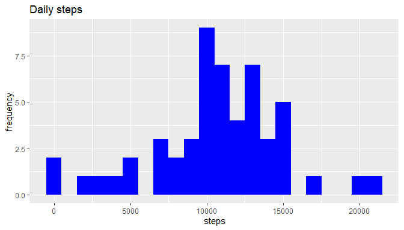
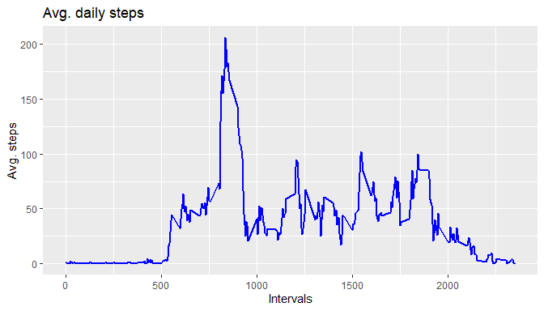
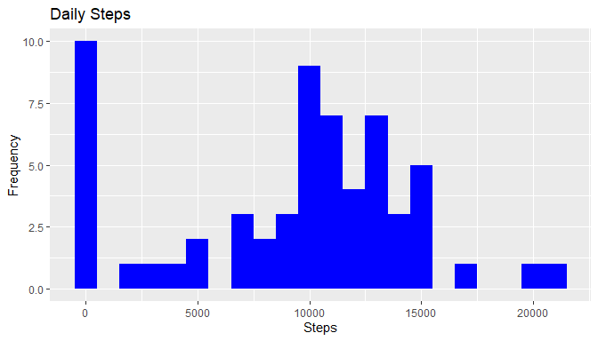
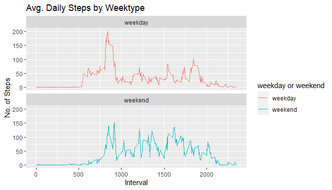

```r
library(data.table)
```

```
## Warning: package 'data.table' was built under R version 4.3.3
```

```r
library(ggplot2)

# Read the CSV file into a data frame
data <- data.table::fread(input = "activity.csv")


# Now you can work with the 'data' data frame
head(data)  # View the first few rows of the data
```

```
##    steps       date interval
##    <int>     <IDat>    <int>
## 1:    NA 2012-10-01        0
## 2:    NA 2012-10-01        5
## 3:    NA 2012-10-01       10
## 4:    NA 2012-10-01       15
## 5:    NA 2012-10-01       20
## 6:    NA 2012-10-01       25
```
## Plotting total number of steps per day

```r
# avg steps per day
total_steps<- data[, vapply(.SD,sum,na.rm=FALSE,numeric(1)), .SDcols = "steps", by=.(date)]

#converting steps column into numeric
total_steps$steps<- as.numeric(total_steps$steps)

#mean and median of total steps per day
mm_steps<-c(mean=mean(total_steps$V1, na.rm=TRUE), median=median(total_steps$V1,na.rm=TRUE))
```

```r
ggplot(total_steps, aes(x= V1))+ geom_histogram(fill="blue", binwidth = 1000)+labs(title="Daily steps", x="steps", y="frequency")
```

```
## Warning: Removed 8 rows containing non-finite values (`stat_bin()`).
```

<!-- -->

##Average daily activity pattern

```r
interval_data<- data[, vapply(.SD,mean,na.rm=TRUE,numeric(1)),.SDcols="steps",by=.(interval)]

head(interval_data)
```

```
##    interval        V1
##       <int>     <num>
## 1:        0 1.7169811
## 2:        5 0.3396226
## 3:       10 0.1320755
## 4:       15 0.1509434
## 5:       20 0.0754717
## 6:       25 2.0943396
```
## Plot for avg. daily activity

```r
ggplot(interval_data, aes(x=interval, y= V1))+geom_line(color="blue",size=1)+labs(title="Avg. daily steps",x="Intervals",y="Avg. steps")
```

```
## Warning: Using `size` aesthetic for lines was deprecated in ggplot2 3.4.0.
## ℹ Please use `linewidth` instead.
## This warning is displayed once every 8 hours.
## Call `lifecycle::last_lifecycle_warnings()` to see where this warning was
## generated.
```

<!-- -->
## interval with max avg steps

```r
max_steps<- interval_data[V1==max(V1), .(max_interval=interval)]

print(max_steps)
```

```
##    max_interval
##           <int>
## 1:          835
```
## Imputing missing values

```r
nrow(data[is.na(steps),])
```

```
## [1] 2304
```
## Handling missing values & data set without NA 

```r
data[is.na(steps),"steps"]<-data[,c(lapply(.SD,median,na.rm=TRUE)),.SDcols=c("steps")]

Total_Steps <- data[, c(lapply(.SD, sum)), .SDcols = c("steps"), by = .(date)] 
```
## Mean and Median

```r
Total_Steps[, .(Mean_Steps = mean(steps), Median_Steps = median(steps))]
```

```
##    Mean_Steps Median_Steps
##         <num>        <int>
## 1:    9354.23        10395
```
## Plotting new data without NA's

```r
ggplot(Total_Steps, aes(x = steps)) + geom_histogram(fill = "blue", binwidth = 1000) + labs(title = "Daily Steps", x = "Steps", y = "Frequency")
```

<!-- -->
# Difference between activity pattern

```r
data <- data.table::fread(input = "activity.csv")
data[, date := as.POSIXct(date, format = "%Y-%m-%d")]
data[, `Day of Week`:= weekdays(x = date)]
data[grepl(pattern = "Monday|Tuesday|Wednesday|Thursday|Friday", x = `Day of Week`), "weekday or weekend"] <- "weekday"
data[grepl(pattern = "Saturday|Sunday", x = `Day of Week`), "weekday or weekend"] <- "weekend"
data[, `weekday or weekend` := as.factor(`weekday or weekend`)]
head(data, 10)
```

```
##     steps       date interval Day of Week weekday or weekend
##     <int>     <POSc>    <int>      <char>             <fctr>
##  1:    NA 2012-10-01        0      Monday            weekday
##  2:    NA 2012-10-01        5      Monday            weekday
##  3:    NA 2012-10-01       10      Monday            weekday
##  4:    NA 2012-10-01       15      Monday            weekday
##  5:    NA 2012-10-01       20      Monday            weekday
##  6:    NA 2012-10-01       25      Monday            weekday
##  7:    NA 2012-10-01       30      Monday            weekday
##  8:    NA 2012-10-01       35      Monday            weekday
##  9:    NA 2012-10-01       40      Monday            weekday
## 10:    NA 2012-10-01       45      Monday            weekday
```

```r
data[is.na(steps), "steps"] <- data[, c(lapply(.SD, median, na.rm = TRUE)), .SDcols = c("steps")]
IntervalDT <- data[, c(lapply(.SD, mean, na.rm = TRUE)), .SDcols = c("steps"), by = .(interval, `weekday or weekend`)] 
```
## Plotting the difference with 5 minutes interval


```r
ggplot(IntervalDT , aes(x = interval , y = steps, color=`weekday or weekend`)) + geom_line() + labs(title = "Avg. Daily Steps by Weektype", x = "Interval", y = "No. of Steps") + facet_wrap(~`weekday or weekend` , ncol = 1, nrow=2)
```

<!-- -->
